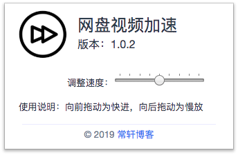

# 通知
由于百度网盘更新了在线播放页面的程序，导致现有插件倍速策略失效。目前正在寻找解决办法...

# 百度网盘视频加速插件


# 前言
由于最近一直在看百度网盘中的网课，但不太好的一点就是不能调节播放速度。如果我直接跳过又担心漏过比较重要的知识点。
所以在网上找了一句调节播放速度的JS代码，如下：
```
//调整播放速度为 1.5 倍
videojs.getPlayers("video-player").html5player.tech_.setPlaybackRate(1.5)
```
感谢 @作者 提供思路，我找了好久都没发现最开始出现在谁的博文中，如原作者看到请联系我我会补上超链接。那么问题就来了，这就意味着每次打开一个视频都得通过「开发者工具」中的 Console 运行这段代码。然后想再调整的时候还得重复一遍上述操作。作为一个合格的程序员，对于一切重复性劳动都要想办法解决它！我开始考虑是否能够写一个浏览器插件可以随时调节视频播放速度。
在此之前我从来没有接触过谷歌浏览器插件开发，但是直觉告诉我应该可以实现的。然后我就找到谷歌浏览器插件开发的官方文档看了看比较重要的部分，接着把我浏览器上安装的插件源码拷出来参考分析。最后感觉差不多了之后，就开始动手开发了。
# 原理
为进度条绑定事件，当滑动时将数值传递给后台的 controlVideo.js 文件.然后将数值与上述关键代码拼接后插入到当前页面中，视频播放速度就会相应变化。细节处理，包括当再次打开插件面板时会将当前视频播放速度的大小体现在进度条上。
# 界面

# 安装
1. 使用git clone 命令或者直接点击下载将项目下载到电脑上。
2. 将下载的文件解压。
3. 打开谷歌浏览器，点击窗口右上角的三个小点，然后点击「更多工具」，接着点击「扩展程序」。这时你在界面上应该可以看到「加载已解压的扩展程序」按钮（如果看不到就把右上角的「开发者模式」打开，如果打开之后仍然看不到那就打开百度，搜索“附近有哪些眼科医院？哦，不行！这种问题还是问谷歌比较安全一些。… ...）。
4. 看到「加载已解压的扩展程序」后然后点击它，在弹出的窗口中选择你刚刚解压后的文件。
  
 *注：解压后的文件就不要动了，一旦删除或移动位置那么谷歌浏览器中的插件将不能使用。所以一开始的时候就应该放置一个比较“安全”的地方。*
# Author
© [常轩](http://changxuan.top), Released under the [GPL](https://github.com/chxcode/speed_video_for_Baidu_Netdisk/blob/master/LICENSE) License.

如果对您有帮助，可以请作者吃根雪糕！


# 更新日志
## V1.0.2
### 2019-07-20
> 项目基本功能完成
